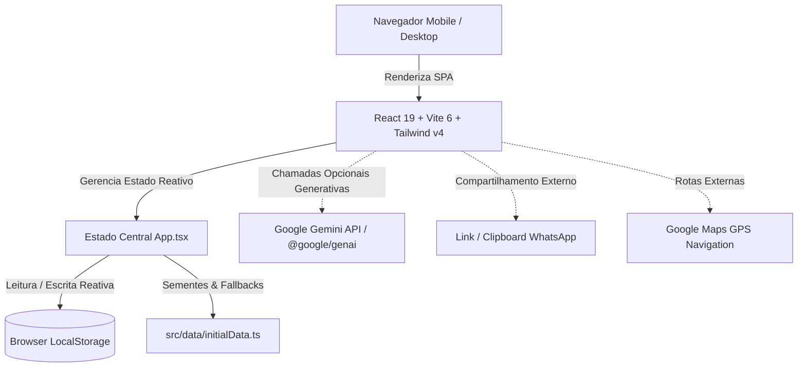

# Arquitetura do Sistema — Na Prancheta

> Gerado pelo **Reversa Arquiteto** em 18/09/2026  
> Nível de Documentação: **Detalhado**  
> Escala de Confiança: 🟢 CONFIRMADO | 🟡 INFERIDO | 🔴 LACUNA

---

## 1. Visão Geral da Arquitetura

O **Na Prancheta** foi projetado como uma aplicação web moderna, responsiva e com foco estrito na experiência do usuário em dispositivos móveis (mobile-first / PWA feel). Sua finalidade é governar o ciclo de vida operacional, disciplinar e financeiro de um time de futebol amador no dia do jogo.

---

## 2. Padrões Arquiteturais e Decisões Estruturais

### 2.1 Padrão Single Page Application (SPA) Reativa
- **Arquitetura Base**: Aplicação puramente frontend estruturada com componentes funcionais React e React Hooks (`useState`, `useEffect`).
- **Comunicação por Prop Drilling & Callbacks**: O componente raiz [`src/App.tsx`](file:///home/adomoraes/projects/na-prancheta/src/App.tsx) mantém a fonte da verdade para o evento ativo, elenco de atletas, confirmações de presença, registros de taxa de jogo (coleta) e scouts, repassando dados e handlers de mutação para os módulos especializados.

### 2.2 Estratégia de Persistência Local-First
- A aplicação utiliza `window.localStorage` como armazenamento persistente entre recargas de página.
- Caso o storage local esteja vazio na primeira execução, o sistema hidrata os estados a partir das constantes de [`src/data/initialData.ts`](file:///home/adomoraes/projects/na-prancheta/src/data/initialData.ts).

### 2.3 Estilização e Design System Moderno
- **Tailwind CSS v4**: Compilado nativamente pelo plugin `@tailwindcss/vite`, dispensando arquivos legados de configuração.
- **Paleta de Cores e Estética Dark Mode**: Zinc 950 como fundo base, acentos semânticos bem definidos (Esmeralda para jogo/presença, Azul para prancheta tática, Âmbar para finanças/vaquinha, Roxo para scout e Rosa para almoxarifado/patrimônio).
- **Tipografia Premium**: `Plus Jakarta Sans` para textos e interfaces funcionais; `Cabinet Grotesk` para títulos e cabeçalhos de impacto.

---

## 3. Mapa de Integrações Externas

| Sistema Externo | Tipo de Integração | Propósito | Confiança |
|---|---|---|---|
| **Google Gemini API** | SDK `@google/genai` (^2.4.0) | Capacidades generativas de análise tática, resumos ou relatórios assistidos por IA (preparado via `metadata.json` e `.env.example`). | 🟢 CONFIRMADO |
| **WhatsApp** | `navigator.clipboard` / URL Scheme | Exportação instantânea do boletim de cobrança e prestação de contas da vaquinha do jogo. | 🟢 CONFIRMADO |
| **Google Maps** | Deep Link HTTP | Navegação direta ponto a ponto do atleta até o campo da partida através do endereço GPS cadastrado. | 🟢 CONFIRMADO |
| **Google Fonts CDN** | Tag `<link>` no HTML | Carregamento otimizado das tipografias `Plus Jakarta Sans` e `Cabinet Grotesk`. | 🟢 CONFIRMADO |

---

## 4. Dívidas Técnicas e Riscos Arquiteturais

1. **Ausência de Backend Centralizado e Concorrência de Dados** 🔴 LACUNA:
   - Toda mutação ocorre apenas no dispositivo que está com a tela aberta. Se o técnico escalar no celular dele e o tesoureiro cobrar no dele, os dados de `localStorage` de um não sincronizam com o do outro automaticamente.
2. **Prop Drilling Centralizado**:
   - `App.tsx` acumula todas as entidades de domínio. Conforme o sistema evoluir para múltiplos eventos ou campeonatos, recomenda-se adotar gerenciamento de estado via Zustand ou React Context modularizado.
3. **Falta de Suite de Testes Automatizados** 🔴 LACUNA:
   - Não há testes unitários para a regra crítica de corte do atraso ($T-35$), cálculos de rateio do tesoureiro ou validação de fechamento de malas do almoxarifado.
