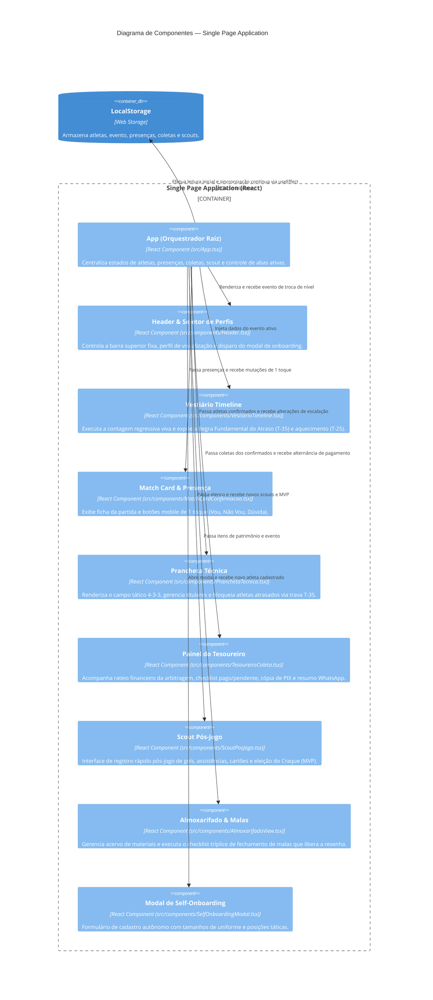

# Diagrama C4 — Nível 3: Componentes Internos da SPA

> Detalhamento dos componentes React que compõem a aplicação Na Prancheta

```mermaid
C4Component
    title Diagrama de Componentes — Single Page Application

    Container_Boundary(spa_boundary, "Single Page Application (React)") {
        Component(appRoot, "App (Orquestrador Raiz)", "React Component (src/App.tsx)", "Centraliza estados de atletas, presenças, coletas, scout e controle de abas ativas.")
        Component(header, "Header & Seletor de Perfis", "React Component (src/components/Header.tsx)", "Controla a barra superior fixa, perfil de visualização e disparo do modal de onboarding.")
        Component(vestiario, "Vestiário Timeline", "React Component (src/components/VestiarioTimeline.tsx)", "Executa a contagem regressiva viva e expõe a Regra Fundamental do Atraso (T-35) e aquecimento (T-25).")
        Component(matchCard, "Match Card & Presença", "React Component (src/components/MatchCardConfirmacao.tsx)", "Exibe ficha da partida e botões mobile de 1 toque (Vou, Não Vou, Dúvida).")
        Component(prancheta, "Prancheta Técnica", "React Component (src/components/PranchetaTecnica.tsx)", "Renderiza o campo tático 4-3-3, gerencia titulares e bloqueia atletas atrasados via trava T-35.")
        Component(tesoureiro, "Painel do Tesoureiro", "React Component (src/components/TesoureiroColeta.tsx)", "Acompanha rateio financeiro da arbitragem, checklist pago/pendente, cópia de PIX e resumo WhatsApp.")
        Component(scout, "Scout Pós-Jogo", "React Component (src/components/ScoutPosJogo.tsx)", "Interface de registro rápido pós-jogo de gols, assistências, cartões e eleição do Craque (MVP).")
        Component(almoxarifado, "Almoxarifado & Malas", "React Component (src/components/AlmoxarifadoView.tsx)", "Gerencia acervo de materiais e executa o checklist tríplice de fechamento de malas que libera a resenha.")
        Component(onboarding, "Modal de Self-Onboarding", "React Component (src/components/SelfOnboardingModal.tsx)", "Formulário de cadastro autônomo com tamanhos de uniforme e posições táticas.")
    }

    ContainerDb(localDb, "LocalStorage", "Web Storage", "Armazena atletas, evento, presenças, coletas e scouts.")

    Rel(appRoot, header, "Renderiza e recebe evento de troca de nível")
    Rel(appRoot, vestiario, "Injeta dados do evento ativo")
    Rel(appRoot, matchCard, "Passa presenças e recebe mutações de 1 toque")
    Rel(appRoot, prancheta, "Passa atletas confirmados e recebe alterações de escalação")
    Rel(appRoot, tesoureiro, "Passa coletas dos confirmados e recebe alternância de pagamento")
    Rel(appRoot, scout, "Passa elenco e recebe novos scouts e MVP")
    Rel(appRoot, almoxarifado, "Passa itens de patrimônio e evento")
    Rel(appRoot, onboarding, "Abre modal e recebe novo atleta cadastrado")

    Rel(appRoot, localDb, "Efetua leitura inicial e sincronização contínua via useEffect", "JSON Serialization")
```
