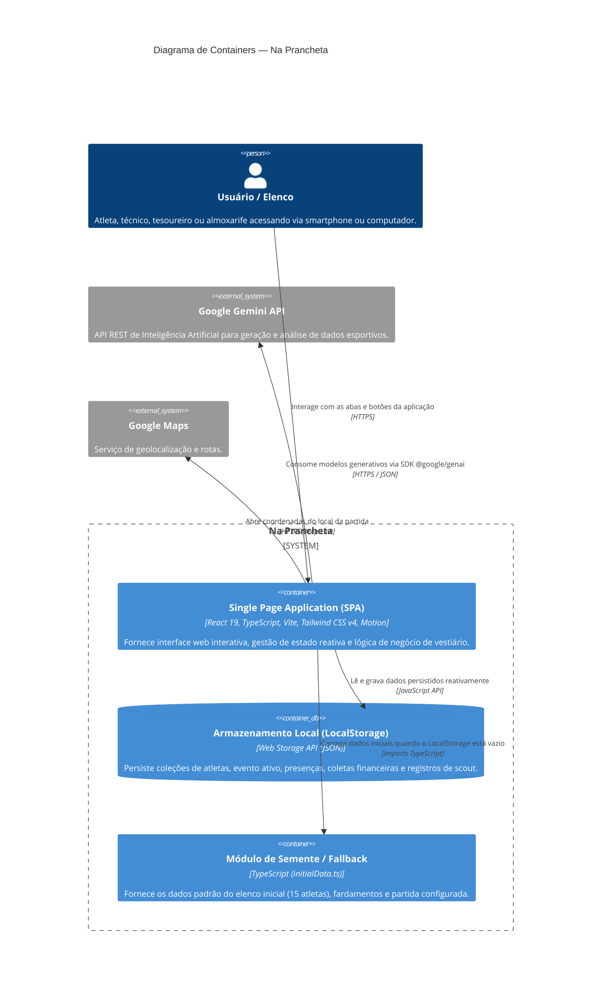

# Diagrama C4 — Nível 2: Containers da Aplicação

> Decomposição do sistema em containers lógicos de execução e armazenamento

```mermaid
C4Container
    title Diagrama de Containers — Na Prancheta

    Person(usuario, "Usuário / Elenco", "Atleta, técnico, tesoureiro ou almoxarife acessando via smartphone ou computador.")

    System_Boundary(c1, "Na Prancheta") {
        Container(spa, "Single Page Application (SPA)", "React 19, TypeScript, Vite, Tailwind CSS v4, Motion", "Fornece interface web interativa, gestão de estado reativa e lógica de negócio de vestiário.")
        ContainerDb(storage, "Armazenamento Local (LocalStorage)", "Web Storage API (JSON)", "Persiste coleções de atletas, evento ativo, presenças, coletas financeiras e registros de scout.")
        Container(mockData, "Módulo de Semente / Fallback", "TypeScript (initialData.ts)", "Fornece os dados padrão do elenco inicial (15 atletas), fardamentos e partida configurada.")
    }

    System_Ext(gemini, "Google Gemini API", "API REST de Inteligência Artificial para geração e análise de dados esportivos.")
    System_Ext(maps, "Google Maps", "Serviço de geolocalização e rotas.")

    Rel(usuario, spa, "Interage com as abas e botões da aplicação", "HTTPS")
    Rel(spa, storage, "Lê e grava dados persistidos reativamente", "JavaScript API")
    Rel(spa, mockData, "Carrega dados iniciais quando o LocalStorage está vazio", "Imports TypeScript")
    Rel(spa, gemini, "Consome modelos generativos via SDK @google/genai", "HTTPS / JSON")
    Rel(spa, maps, "Abre coordenadas do local da partida", "HTTPS Deep Link")
```
