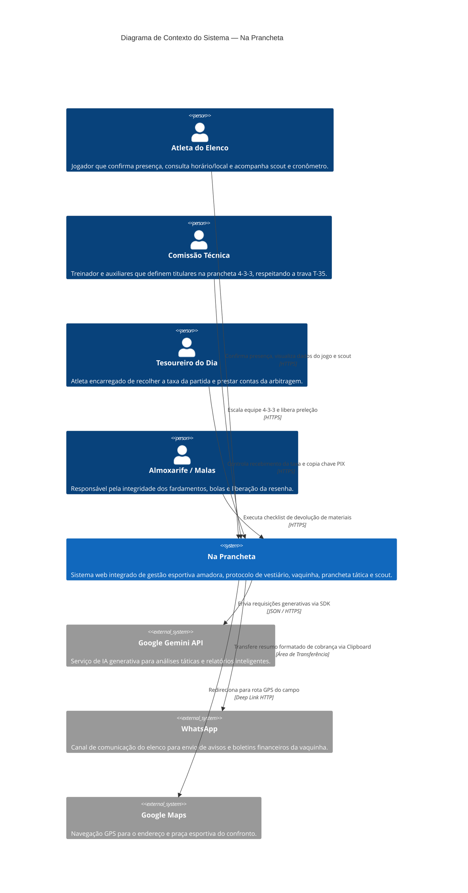

# Diagrama C4 — Nível 1: Contexto do Sistema

> Mapeamento de atores, sistema central e integrações externas

```mermaid
C4Context
    title Diagrama de Contexto do Sistema — Na Prancheta

    Person(atleta, "Atleta do Elenco", "Jogador que confirma presença, consulta horário/local e acompanha scout e cronômetro.")
    Person(tecnico, "Comissão Técnica", "Treinador e auxiliares que definem titulares na prancheta 4-3-3, respeitando a trava T-35.")
    Person(tesoureiro, "Tesoureiro do Dia", "Atleta encarregado de recolher a taxa da partida e prestar contas da arbitragem.")
    Person(almoxarife, "Almoxarife / Malas", "Responsável pela integridade dos fardamentos, bolas e liberação da resenha.")

    System(naPrancheta, "Na Prancheta", "Sistema web integrado de gestão esportiva amadora, protocolo de vestiário, vaquinha, prancheta tática e scout.")

    System_Ext(geminiApi, "Google Gemini API", "Serviço de IA generativa para análises táticas e relatórios inteligentes.")
    System_Ext(whatsApp, "WhatsApp", "Canal de comunicação do elenco para envio de avisos e boletins financeiros da vaquinha.")
    System_Ext(googleMaps, "Google Maps", "Navegação GPS para o endereço e praça esportiva do confronto.")

    Rel(atleta, naPrancheta, "Confirma presença, visualiza dados do jogo e scout", "HTTPS")
    Rel(tecnico, naPrancheta, "Escala equipe 4-3-3 e libera preleção", "HTTPS")
    Rel(tesoureiro, naPrancheta, "Controla recebimento da taxa e copia chave PIX", "HTTPS")
    Rel(almoxarife, naPrancheta, "Executa checklist de devolução de materiais", "HTTPS")

    Rel(naPrancheta, geminiApi, "Envia requisições generativas via SDK", "JSON / HTTPS")
    Rel(naPrancheta, whatsApp, "Transfere resumo formatado de cobrança via Clipboard", "Área de Transferência")
    Rel(naPrancheta, googleMaps, "Redireciona para rota GPS do campo", "Deep Link HTTP")
```
