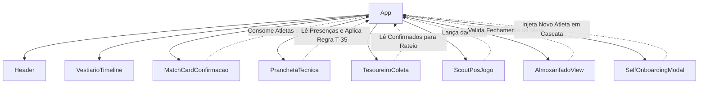

# Análise Técnica Consolidada de Código — Na Prancheta

> Gerado pelo **Reversa Arqueólogo** em 18/09/2026  
> Nível de Documentação: **Detalhado**  
> Escala de Confiança: 🟢 CONFIRMADO | 🟡 INFERIDO | 🔴 LACUNA

---

## 1. Arquitetura Geral do Sistema

O **Na Prancheta** é uma Single Page Application (SPA) construída com **React 19**, **TypeScript** e empacotada com **Vite 6**, estilizada através do utilitário **Tailwind CSS v4** e ícones **Lucide React**.

### 1.1 Modelo de Execução e Estado Central
O componente raiz [`src/App.tsx`](file:///home/adomoraes/projects/na-prancheta/src/App.tsx) opera como o coordenador de estado central da aplicação:
- **Camada de Dados**: Não há dependência de API HTTP externa ativa nem banco de dados relacional remoto no runtime client-side. A persistência é viabilizada pelo `window.localStorage` com sementes e fallbacks em memória definidos em [`src/data/initialData.ts`](file:///home/adomoraes/projects/na-prancheta/src/data/initialData.ts).
- **Sincronização Reativa**: Modificações nos estados de `atletas`, `evento`, `presencas`, `coletas` e `scoutList` disparam `useEffect` hooks que serializam e armazenam o estado atualizado no `localStorage`.
- **Roteamento Interno por Abas**: Controle por estado local `activeTab` entre `'jogo'`, `'tatica'`, `'financeiro'`, `'scout'` e `'almoxarifado'`.
- **Matriz de Perfis/Visão**: O cabeçalho [`src/components/Header.tsx`](file:///home/adomoraes/projects/na-prancheta/src/components/Header.tsx) permite alternar o `nivelAcesso` entre `'atleta'`, `'tecnico'`, `'financeiro'` e `'almoxarifado'`, direcionando automaticamente para a aba relevante.

---

## 2. Análise Detalhada dos Módulos

### 2.1 Módulo: `protocolo-vestiario`
- **Arquivo Primário**: [`src/components/VestiarioTimeline.tsx`](file:///home/adomoraes/projects/na-prancheta/src/components/VestiarioTimeline.tsx)
- **Propósito**: Gestão cronológica dos marcos preparatórios anteriores ao apito inicial de uma partida de futebol amador, garantindo pontualidade, preleção tática e aquecimento neuromuscular.
- **Estrutura de Controle e Algoritmo**:
  - Estado `countdownMinutes` com simulação dinâmica a cada 15 segundos decrementando minutos até a partida (`T-0`).
  - Avaliação de marcos:
    - **T-70 min**: Comissão técnica e responsáveis pelas malas abrem o vestiário e organizam os fardamentos.
    - **T-50 min**: Horário limite de apresentação obrigatória de todo o elenco para início da troca de roupas e chuteiras.
    - **T-35 min**: Fechamento da porta para preleção técnica e revelação dos 11 titulares.
    - **T-25 min**: Saída para o campo e execução da sequência fisiológica em 4 fases: Ativação (5-8 min), Mobilidade (5 min), Dinâmica/Rondo (8 min) e Técnica (8 min).
  - **Regra Fundamental do Atraso (T-35)** 🟢 CONFIRMADO: Atleta que não estiver pronto no vestiário até T-35 é cortado da titularidade e direcionado compulsoriamente ao banco de reservas.

### 2.2 Módulo: `confirmacao-presenca`
- **Arquivo Primário**: [`src/components/MatchCardConfirmacao.tsx`](file:///home/adomoraes/projects/na-prancheta/src/components/MatchCardConfirmacao.tsx)
- **Propósito**: Confirmação expressa de presença e consulta de dados logísticos do jogo (adversário, horário, link GPS para rota, kit de uniforme e tesoureiro).
- **Estrutura de Controle e Algoritmo**:
  - Confirmação de 1 toque: Handlers acionados por botões otimizados para toque mobile (52px de altura mínima) alternam o status da presença entre `'confirmado'`, `'recusado'` e `'duvida'`.
  - Agregação em tempo real dos totais de confirmados, dúvidas e ausências.
  - Verificação de atraso: Compara `atleta.chegou_em` com padrão de texto indicativo de atraso para sinalizar no card do atleta.

### 2.3 Módulo: `prancheta-tatica`
- **Arquivo Primário**: [`src/components/PranchetaTecnica.tsx`](file:///home/adomoraes/projects/na-prancheta/src/components/PranchetaTecnica.tsx)
- **Propósito**: Definição da escalação oficial da equipe, esquema tático no campo visual sintético e gestão de substituições/reservas.
- **Estrutura de Controle e Algoritmo**:
  - Filtro de elegibilidade: Somente atletas com status `'confirmado'` em `EventoPresenca` são exibidos na prancheta.
  - **Validação Algorítmica da Trava T-35** 🟢 CONFIRMADO:
    ```typescript
    if (atleta.chegou_em?.includes('Atrasado')) {
      alert(`Regra do Vestiário (T-35): ${atleta.apelido || atleta.nome} chegou após o horário obrigatório...`);
      return;
    }
    ```
  - Trava de limite de titulares: Máximo de 11 atletas na lista `titularesIds`. Qualquer tentativa de adicionar um 12º atleta é bloqueada.
  - Divulgação oficial: Simulação de envio da escalação para o vestiário com feedback de 3 segundos no botão de liberação.

### 2.4 Módulo: `tesoureiro-vaquinha`
- **Arquivo Primário**: [`src/components/TesoureiroColeta.tsx`](file:///home/adomoraes/projects/na-prancheta/src/components/TesoureiroColeta.tsx)
- **Propósito**: Rateio financeiro dos custos da partida (arbitragem, campo ou materiais), controle de cobrança individual e transparência via WhatsApp.
- **Estrutura de Controle e Algoritmo**:
  - Rateio restrito: Apenas atletas com presença confirmada são incluídos na vaquinha do dia.
  - Fórmulas de cálculo financeiro 🟢 CONFIRMADO:
    - $\text{Total Esperado} = \text{Qtd Confirmados} \times \text{Taxa Individual}$
    - $\text{Total Arrecadado} = \sum (\text{valor\_pago} \mid \text{pago} = \text{true})$
    - $\text{Total Pendente} = \text{Total Esperado} - \text{Total Arrecadado}$
    - $\text{Percentual Coberto} = (\text{Total Arrecadado} / \text{Meta Arbitragem}) \times 100$
  - Alternância de 1 toque: Toggle `onTogglePago` atualiza o estado booleano e registra timestamp `pago_em`.
  - Gerador de resumo WhatsApp: Concatena string formatada com emojis e lista separada de atletas inadimplentes e pagantes, copiando para a área de transferência.

### 2.5 Módulo: `scout-pos-jogo`
- **Arquivo Primário**: [`src/components/ScoutPosJogo.tsx`](file:///home/adomoraes/projects/na-prancheta/src/components/ScoutPosJogo.tsx)
- **Propósito**: Coleta simplificada e ultrarrápida (< 2 min) de dados quantitativos individuais de desempenho após o término da partida.
- **Estrutura de Controle e Algoritmo**:
  - Controles incrementais/decrementais rápidos: Funções `updateField(campo, delta)` com validação contra valores negativos (`val < 0`).
  - Minutagem ajustada em degraus de $\pm 5$ minutos para facilidade operacional.
  - Regra de Eleição de MVP: Alternância do status `foi_mvp` com indicação de destaque visual no topo do módulo.
  - Métricas agregadas: Redutores somando gols do time e assistências totais no confronto.

### 2.6 Módulo: `almoxarifado-patrimonio`
- **Arquivo Primário**: [`src/components/AlmoxarifadoView.tsx`](file:///home/adomoraes/projects/na-prancheta/src/components/AlmoxarifadoView.tsx)
- **Propósito**: Custódia física das malas de uniforme, bolas e equipamentos de treino, além de governança do ritual de encerramento do vestiário.
- **Estrutura de Controle e Algoritmo**:
  - **Algoritmo da Trava da Resenha Social** 🟢 CONFIRMADO:
    ```typescript
    const tudoConferido = malaConferida && uniformesLadoCorreto && bolasRecolhidas;
    ```
    Se `tudoConferido === false`, o status da resenha social permanece `"BLOQUEADA (Aguardando malas) ⏳"`. Apenas quando todas as 3 condicionais são satisfeitas o status muda para `"LIBERADA ✅"`.
  - Controle de integridade das camisas: Exigência explícita de desvirar os uniformes do avesso antes do depósito na mala para lavagem correta.

### 2.7 Módulo: `onboarding-elenco`
- **Arquivo Primário**: [`src/components/SelfOnboardingModal.tsx`](file:///home/adomoraes/projects/na-prancheta/src/components/SelfOnboardingModal.tsx)
- **Propósito**: Auto-cadastro simplificado de novos integrantes (mensalistas fixos ou convidados esporádicos) no banco de atletas do time.
- **Estrutura de Controle e Algoritmo**:
  - Validação de entrada: Exige nome completo preenchido (`nome.trim()`).
  - Geração de ID único client-side: `atl-${Date.now()}`.
  - Mapeamento de vestuário: Seletores específicos para tamanhos de camisa e calção (P, M, G, GG).
  - Inclusão em cascata: Ao submeter, cria o `Atleta`, adiciona presença padrão confirmada em `EventoPresenca` e cria registro em aberto em `EventoColetaDia`.

---

## 3. Matriz de Dependências Internas entre Componentes



---

## 4. Avaliação de Lacunas e Débitos Técnicos (🔴 LACUNAS)

1. **Persistência Volátil no Navegador**: Os dados residem estritamente no `localStorage` de quem estiver operando a tela. Não há sincronização em tempo real (WebSockets / SSE) nem persistência em banco relacional multi-usuário compartilhado.
2. **Autenticação e Permissões**: A troca de perfis (`atleta`, `tecnico`, `financeiro`, `almoxarifado`) é apenas cosmética e ilustrativa (troca de visão no cliente). Não há controle real de acesso por sessão/token JWT.
3. **Simulação do Tempo**: O cronômetro de vestiário utiliza um estado estático decrementado artificialmente por `setInterval` em vez de calcular a diferença estrita em milissegundos contra `evento.data_hora` do relógio do sistema.
