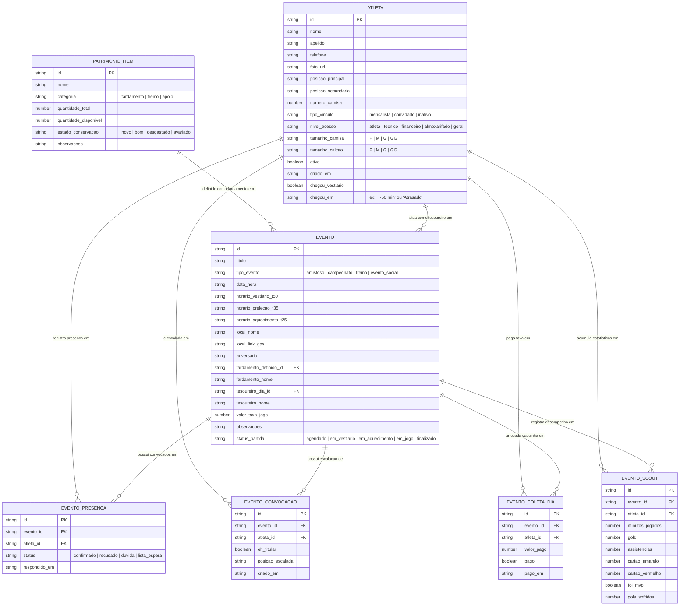

# Diagrama Entidade-Relacionamento Completo (ERD) — Na Prancheta

> Mapeamento de entidades, atributos, tipos e cardinalidades relacionais

```mermaid
erDiagram
    ATLETA ||--o{ EVENTO_PRESENCA : "registra presenca em"
    EVENTO ||--o{ EVENTO_PRESENCA : "possui convocados em"

    ATLETA ||--o{ EVENTO_CONVOCACAO : "e escalado em"
    EVENTO ||--o{ EVENTO_CONVOCACAO : "possui escalacao de"

    ATLETA ||--o{ EVENTO_COLETA_DIA : "paga taxa em"
    EVENTO ||--o{ EVENTO_COLETA_DIA : "arrecada vaquinha em"

    ATLETA ||--o{ EVENTO_SCOUT : "acumula estatisticas em"
    EVENTO ||--o{ EVENTO_SCOUT : "registra desempenho em"

    PATRIMONIO_ITEM ||--o{ EVENTO : "definido como fardamento em"
    ATLETA ||--o{ EVENTO : "atua como tesoureiro em"

    ATLETA {
        string id PK
        string nome
        string apelido
        string telefone
        string foto_url
        string posicao_principal
        string posicao_secundaria
        number numero_camisa
        string tipo_vinculo "mensalista | convidado | inativo"
        string nivel_acesso "atleta | tecnico | financeiro | almoxarifado | geral"
        string tamanho_camisa "P | M | G | GG"
        string tamanho_calcao "P | M | G | GG"
        boolean ativo
        string criado_em
        boolean chegou_vestiario
        string chegou_em "ex: 'T-50 min' ou 'Atrasado'"
    }

    EVENTO {
        string id PK
        string titulo
        string tipo_evento "amistoso | campeonato | treino | evento_social"
        string data_hora
        string horario_vestiario_t50
        string horario_prelecao_t35
        string horario_aquecimento_t25
        string local_nome
        string local_link_gps
        string adversario
        string fardamento_definido_id FK
        string fardamento_nome
        string tesoureiro_dia_id FK
        string tesoureiro_nome
        number valor_taxa_jogo
        string observacoes
        string status_partida "agendado | em_vestiario | em_aquecimento | em_jogo | finalizado"
    }

    EVENTO_PRESENCA {
        string id PK
        string evento_id FK
        string atleta_id FK
        string status "confirmado | recusado | duvida | lista_espera"
        string respondido_em
    }

    EVENTO_CONVOCACAO {
        string id PK
        string evento_id FK
        string atleta_id FK
        boolean eh_titular
        string posicao_escalada
        string criado_em
    }

    EVENTO_COLETA_DIA {
        string id PK
        string evento_id FK
        string atleta_id FK
        number valor_pago
        boolean pago
        string pago_em
    }

    EVENTO_SCOUT {
        string id PK
        string evento_id FK
        string atleta_id FK
        number minutos_jogados
        number gols
        number assistencias
        number cartao_amarelo
        number cartao_vermelho
        boolean foi_mvp
        number gols_sofridos
    }

    PATRIMONIO_ITEM {
        string id PK
        string nome
        string categoria "fardamento | treino | apoio"
        number quantidade_total
        number quantidade_disponivel
        string estado_conservacao "novo | bom | desgastado | avariado"
        string observacoes
    }
```
