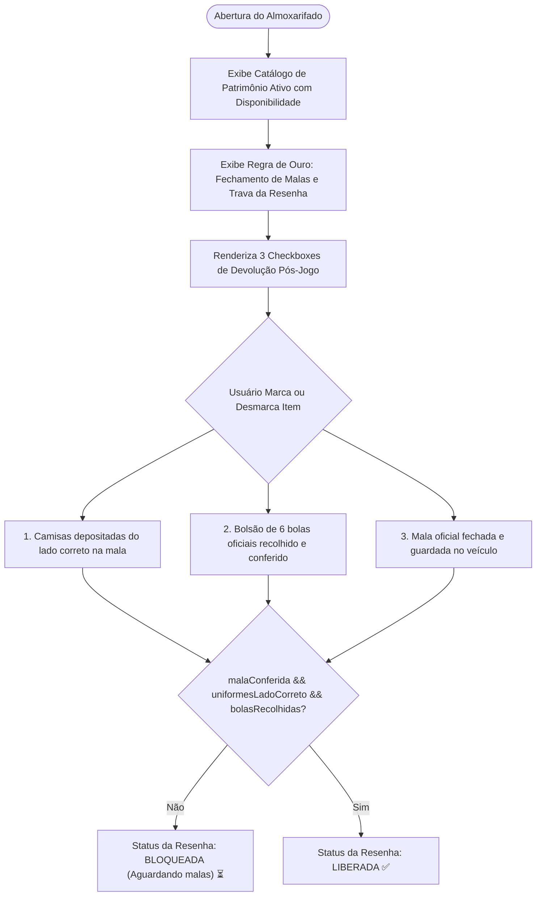

# Fluxograma — Almoxarifado e Checklist de Malas

> Módulo: `almoxarifado-patrimonio`  
> Componente: `src/components/AlmoxarifadoView.tsx`

```mermaid
flowchart TD
    InitAlmoxarifado([Abertura do Almoxarifado]) --> RenderInventario[Exibe Catálogo de Patrimônio Ativo com Disponibilidade]
    RenderInventario --> RenderRegraOuro[Exibe Regra de Ouro: Fechamento de Malas e Trava da Resenha]
    RenderRegraOuro --> RenderChecklist[Renderiza 3 Checkboxes de Devolução Pós-Jogo]
    
    RenderChecklist --> UserCheckItem{Usuário Marca ou Desmarca Item}
    
    UserCheckItem --> Item1[1. Camisas depositadas do lado correto na mala]
    UserCheckItem --> Item2[2. Bolsão de 6 bolas oficiais recolhido e conferido]
    UserCheckItem --> Item3[3. Mala oficial fechada e guardada no veículo]
    
    Item1 --> AvaliaTriplice{malaConferida && uniformesLadoCorreto && bolasRecolhidas?}
    Item2 --> AvaliaTriplice
    Item3 --> AvaliaTriplice
    
    AvaliaTriplice -- Não --> BloqueiaResenha["Status da Resenha: BLOQUEADA (Aguardando malas) ⏳"]
    AvaliaTriplice -- Sim --> LiberaResenha["Status da Resenha: LIBERADA ✅"]
```
