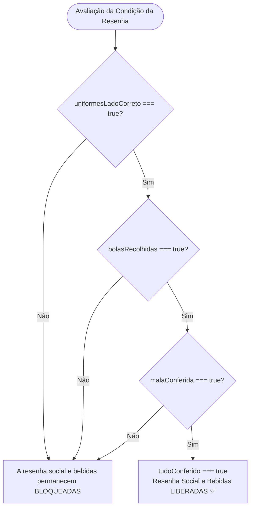

# Fluxograma de Função — Trava da Resenha Social e Fechamento de Malas

> Módulo: `almoxarifado-patrimonio`  
> Lógica: Algoritmo booleano tríplice de liberação da resenha

```mermaid
flowchart TD
    CheckIniciada([Avaliação da Condição da Resenha]) --> CheckCamisas{uniformesLadoCorreto === true?}
    
    CheckCamisas -- Não --> Bloqueio["A resenha social e bebidas permanecem BLOQUEADAS"]
    CheckCamisas -- Sim --> CheckBolas{bolasRecolhidas === true?}
    
    CheckBolas -- Não --> Bloqueio
    CheckBolas -- Sim --> CheckMala{malaConferida === true?}
    
    CheckMala -- Não --> Bloqueio
    CheckMala -- Sim --> LiberaSocial["tudoConferido === true<br/>Resenha Social e Bebidas LIBERADAS ✅"]
```
