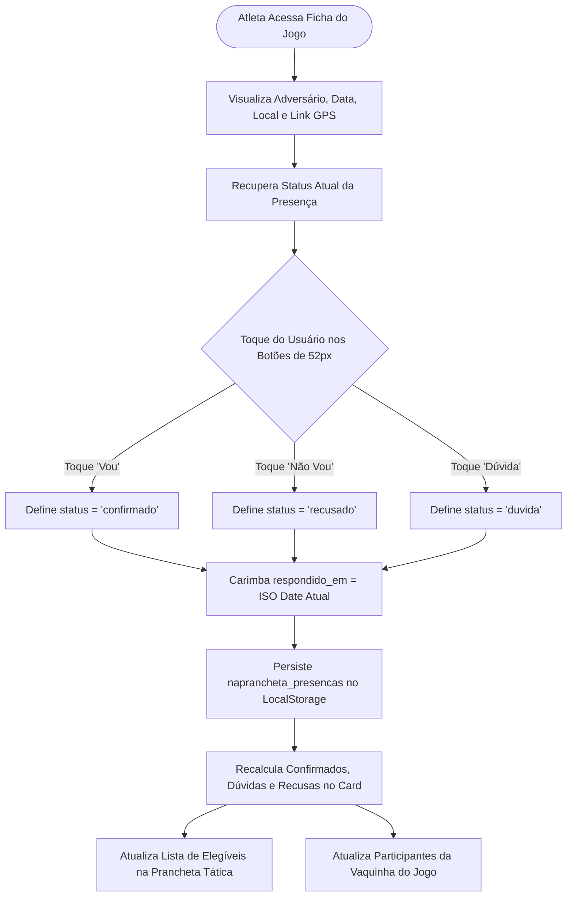

# Fluxograma — Confirmação de Presença de 1 Toque

> Módulo: `confirmacao-presenca`  
> Componente: `src/components/MatchCardConfirmacao.tsx`

```mermaid
flowchart TD
    OpenCard([Atleta Acessa Ficha do Jogo]) --> VisualizaInfo[Visualiza Adversário, Data, Local e Link GPS]
    VisualizaInfo --> IdentificaStatusAtual[Recupera Status Atual da Presença]
    
    IdentificaStatusAtual --> UserAction{Toque do Usuário nos Botões de 52px}
    
    UserAction -- Toque 'Vou' --> SetConfirmado[Define status = 'confirmado']
    UserAction -- Toque 'Não Vou' --> SetRecusado[Define status = 'recusado']
    UserAction -- Toque 'Dúvida' --> SetDuvida[Define status = 'duvida']
    
    SetConfirmado --> UpdateTimestamp[Carimba respondido_em = ISO Date Atual]
    SetRecusado --> UpdateTimestamp
    SetDuvida --> UpdateTimestamp
    
    UpdateTimestamp --> PersistLocalStorage[Persiste naprancheta_presencas no LocalStorage]
    PersistLocalStorage --> RecalculaTotalizadores[Recalcula Confirmados, Dúvidas e Recusas no Card]
    RecalculaTotalizadores --> UpdatePrancheta[Atualiza Lista de Elegíveis na Prancheta Tática]
    RecalculaTotalizadores --> UpdateTesoureiro[Atualiza Participantes da Vaquinha do Jogo]
```
