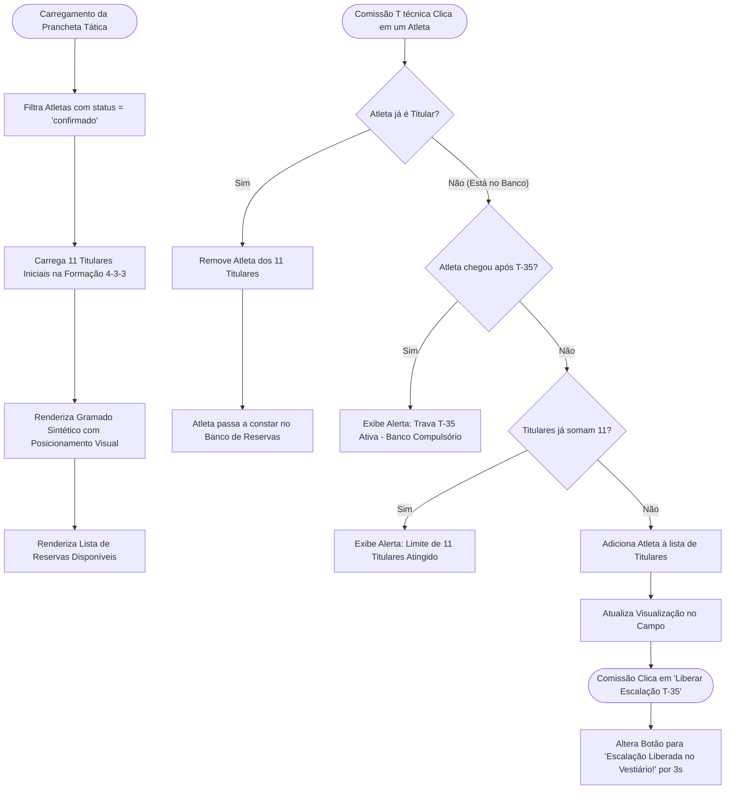

# Fluxograma — Prancheta Tática e Gestão de Titulares

> Módulo: `prancheta-tatica`  
> Componente: `src/components/PranchetaTecnica.tsx`

```mermaid
flowchart TD
    InitPrancheta([Carregamento da Prancheta Tática]) --> FiltraConfirmados[Filtra Atletas com status = 'confirmado']
    FiltraConfirmados --> MontaEscalacaoInicial[Carrega 11 Titulares Iniciais na Formação 4-3-3]
    MontaEscalacaoInicial --> RenderCampo[Renderiza Gramado Sintético com Posicionamento Visual]
    RenderCampo --> RenderBanco[Renderiza Lista de Reservas Disponíveis]
    
    ClickAtleta([Comissão T técnica Clica em um Atleta]) --> CheckOrigem{Atleta já é Titular?}
    
    CheckOrigem -- Sim --> RemoveTitular[Remove Atleta dos 11 Titulares]
    RemoveTitular --> MoveParaBanco[Atleta passa a constar no Banco de Reservas]
    
    CheckOrigem -- Não (Está no Banco) --> CheckAtraso{Atleta chegou após T-35?}
    CheckAtraso -- Sim --> BloqueioAtraso[Exibe Alerta: Trava T-35 Ativa - Banco Compulsório]
    CheckAtraso -- Não --> CheckLimite{Titulares já somam 11?}
    
    CheckLimite -- Sim --> AlertaLimite[Exibe Alerta: Limite de 11 Titulares Atingido]
    CheckLimite -- Não --> AdicionaTitular[Adiciona Atleta à lista de Titulares]
    AdicionaTitular --> AtualizaCampo[Atualiza Visualização no Campo]
    
    AtualizaCampo --> DivulgarPrelecao([Comissão Clica em 'Liberar Escalação T-35'])
    DivulgarPrelecao --> FeedbackLiberado[Altera Botão para 'Escalação Liberada no Vestiário!' por 3s]
```
