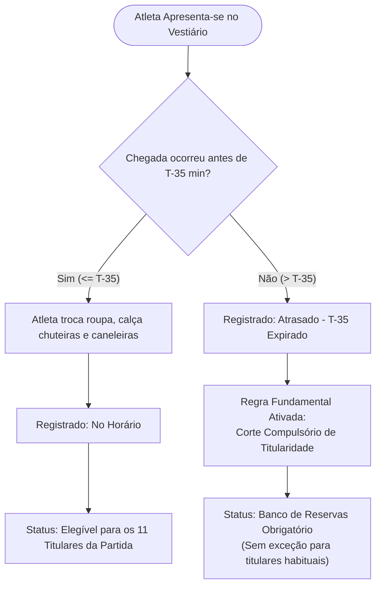

# Fluxograma de Função — Regra Fundamental do Atraso (T-35)

> Módulo: `protocolo-vestiario`  
> Regra: Corte compulsório de titularidade por atraso no vestiário

```mermaid
flowchart TD
    AtletaChega([Atleta Apresenta-se no Vestiário]) --> ChecaHorario{Chegada ocorreu antes de T-35 min?}
    
    ChecaHorario -- Sim (<= T-35) --> TrocaRoupa[Atleta troca roupa, calça chuteiras e caneleiras]
    TrocaRoupa --> RegistraPontual[Registrado: No Horário]
    RegistraPontual --> AptoTitular[Status: Elegível para os 11 Titulares da Partida]
    
    ChecaHorario -- Não (> T-35) --> MarcaAtraso[Registrado: Atrasado - T-35 Expirado]
    MarcaAtraso --> AcionaRegra["Regra Fundamental Ativada:<br/>Corte Compulsório de Titularidade"]
    AcionaRegra --> ForcaBanco["Status: Banco de Reservas Obrigatório<br/>(Sem exceção para titulares habituais)"]
```
