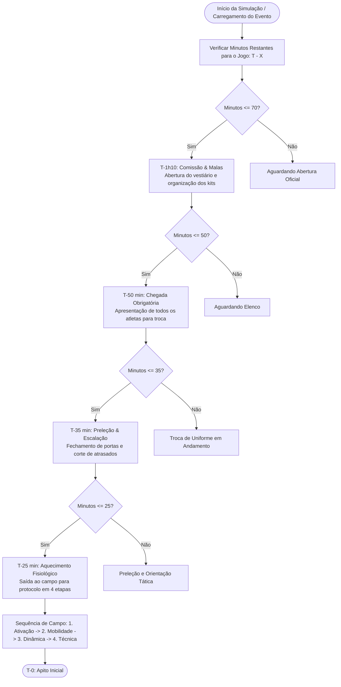

# Fluxograma — Protocolo Oficial de Vestiário

> Módulo: `protocolo-vestiario`  
> Componente: `src/components/VestiarioTimeline.tsx`

```mermaid
graph TD
    Start([Início da Simulação / Carregamento do Evento]) --> CheckTime[Verificar Minutos Restantes para o Jogo: T - X]
    
    CheckTime --> Cond70{Minutos <= 70?}
    Cond70 -- Sim --> State70["T-1h10: Comissão & Malas<br/>Abertura do vestiário e organização dos kits"]
    Cond70 -- Não --> Wait70[Aguardando Abertura Oficial]
    
    State70 --> Cond50{Minutos <= 50?}
    Cond50 -- Sim --> State50["T-50 min: Chegada Obrigatória<br/>Apresentação de todos os atletas para troca"]
    Cond50 -- Não --> Wait50[Aguardando Elenco]
    
    State50 --> Cond35{Minutos <= 35?}
    Cond35 -- Sim --> State35["T-35 min: Preleção & Escalação<br/>Fechamento de portas e corte de atrasados"]
    Cond35 -- Não --> Wait35[Troca de Uniforme em Andamento]
    
    State35 --> Cond25{Minutos <= 25?}
    Cond25 -- Sim --> State25["T-25 min: Aquecimento Fisiológico<br/>Saída ao campo para protocolo em 4 etapas"]
    Cond25 -- Não --> Wait25[Preleção e Orientação Tática]
    
    State25 --> SeqWarmup[Sequência de Campo: 1. Ativação -> 2. Mobilidade -> 3. Dinâmica -> 4. Técnica]
    SeqWarmup --> Kickoff([T-0: Apito Inicial])
```
