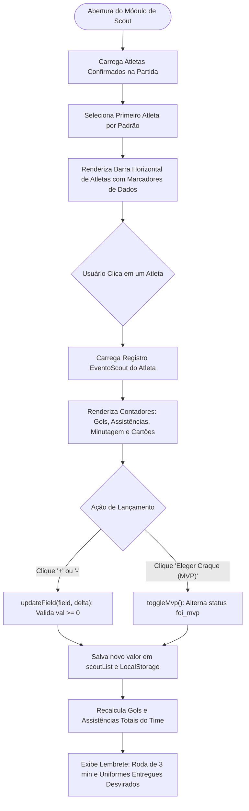

# Fluxograma — Lançamento Expresso de Scout Pós-Jogo

> Módulo: `scout-pos-jogo`  
> Componente: `src/components/ScoutPosJogo.tsx`

```mermaid
flowchart TD
    OpenScout([Abertura do Módulo de Scout]) --> FiltraConfirmados[Carrega Atletas Confirmados na Partida]
    FiltraConfirmados --> SelectDefault[Seleciona Primeiro Atleta por Padrão]
    SelectDefault --> RenderHorizontalList[Renderiza Barra Horizontal de Atletas com Marcadores de Dados]
    
    RenderHorizontalList --> UserSelectAtleta{Usuário Clica em um Atleta}
    UserSelectAtleta --> LoadScoutData[Carrega Registro EventoScout do Atleta]
    
    LoadScoutData --> RenderCounters[Renderiza Contadores: Gols, Assistências, Minutagem e Cartões]
    
    RenderCounters --> UserScoutAction{Ação de Lançamento}
    
    UserScoutAction -- Clique '+' ou '-' --> UpdateField["updateField(field, delta): Valida val >= 0"]
    UpdateField --> SaveScoutState[Salva novo valor em scoutList e LocalStorage]
    SaveScoutState --> RecalculaTotaisTime[Recalcula Gols e Assistências Totais do Time]
    
    UserScoutAction -- Clique 'Eleger Craque (MVP)' --> ToggleMvp["toggleMvp(): Alterna status foi_mvp"]
    ToggleMvp --> SaveScoutState
    
    RecalculaTotaisTime --> ProtocoloAviso[Exibe Lembrete: Roda de 3 min e Uniformes Entregues Desvirados]
```
