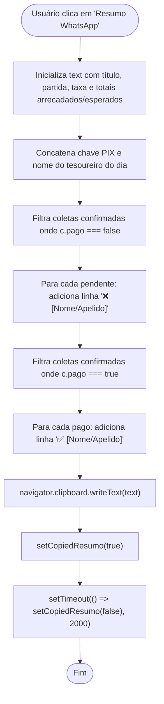

# Fluxograma de Função — Algoritmo `handleCopyResumoWhatsApp`

> Módulo: `tesoureiro-vaquinha`  
> Função: `handleCopyResumoWhatsApp()` em `src/components/TesoureiroColeta.tsx`

```mermaid
flowchart TD
    ClickBotao([Usuário clica em 'Resumo WhatsApp']) --> HeaderString["Inicializa text com título, partida, taxa e totais arrecadados/esperados"]
    HeaderString --> AddPix["Concatena chave PIX e nome do tesoureiro do dia"]
    
    AddPix --> FilterPendentes["Filtra coletas confirmadas onde c.pago === false"]
    FilterPendentes --> AppendPendentes["Para cada pendente: adiciona linha '❌ [Nome/Apelido]'"]
    
    AppendPendentes --> FilterPagos["Filtra coletas confirmadas onde c.pago === true"]
    FilterPagos --> AppendPagos["Para cada pago: adiciona linha '✅ [Nome/Apelido]'"]
    
    AppendPagos --> WriteClipboard["navigator.clipboard.writeText(text)"]
    WriteClipboard --> SetFeedbackState["setCopiedResumo(true)"]
    SetFeedbackState --> StartTimer["setTimeout(() => setCopiedResumo(false), 2000)"]
    StartTimer --> Done([Fim])
```
