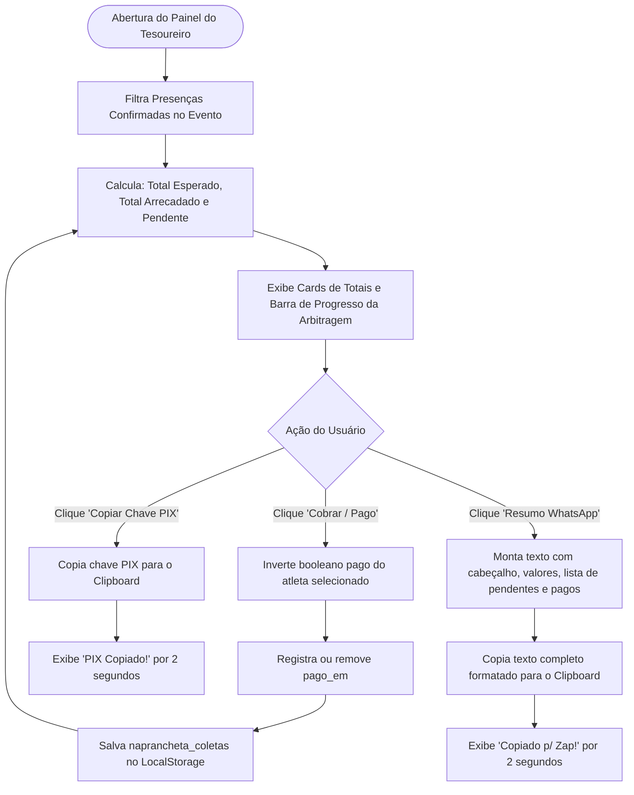

# Fluxograma — Painel do Tesoureiro e Vaquinha do Jogo

> Módulo: `tesoureiro-vaquinha`  
> Componente: `src/components/TesoureiroColeta.tsx`

```mermaid
flowchart TD
    InitTesoureiro([Abertura do Painel do Tesoureiro]) --> ObterConfirmados[Filtra Presenças Confirmadas no Evento]
    ObterConfirmados --> CalculaMetricas[Calcula: Total Esperado, Total Arrecadado e Pendente]
    CalculaMetricas --> RenderCards[Exibe Cards de Totais e Barra de Progresso da Arbitragem]
    
    RenderCards --> UserAction{Ação do Usuário}
    
    UserAction -- Clique 'Cobrar / Pago' --> ToggleStatus[Inverte booleano pago do atleta selecionado]
    ToggleStatus --> UpdateTimestamp[Registra ou remove pago_em]
    UpdateTimestamp --> PersistColetas[Salva naprancheta_coletas no LocalStorage]
    PersistColetas --> CalculaMetricas
    
    UserAction -- Clique 'Copiar Chave PIX' --> CopyPix[Copia chave PIX para o Clipboard]
    CopyPix --> FeedbackPix[Exibe 'PIX Copiado!' por 2 segundos]
    
    UserAction -- Clique 'Resumo WhatsApp' --> BuildText[Monta texto com cabeçalho, valores, lista de pendentes e pagos]
    BuildText --> CopyWhatsApp[Copia texto completo formatado para o Clipboard]
    CopyWhatsApp --> FeedbackZap[Exibe 'Copiado p/ Zap!' por 2 segundos]
```
