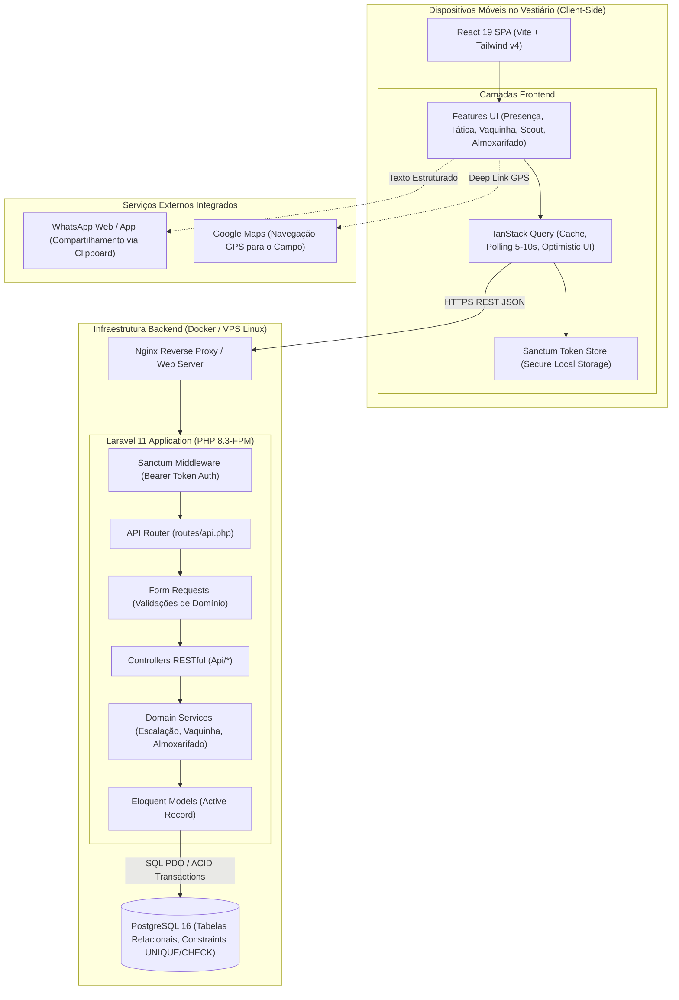

# Target Architecture — Na Prancheta

> Arquitetura alvo do sistema novo, respeitando o paradigma Active Record/RESTful em `paradigm_decision.md`, a estratégia de corte por ondas em `migration_strategy.md` e a topologia moderna em `topology_decision.md`.

## Visão geral
O **Na Prancheta** migra de uma Single Page Application local-first isolada para uma plataforma web desacoplada client-server:
- **Backend**: API RESTful construída em **Laravel 11 (PHP 8.3+)** com banco relacional **PostgreSQL 16**, autenticação stateless via **Laravel Sanctum** e isolamento transacional ACID.
- **Frontend**: A SPA **React 19 + TypeScript + Vite** existente é mantida desacoplada, reorganizada por features e conectada à API REST através de cliente HTTP com **TanStack Query** (suportando polling inteligente de 5–10s, cache local resiliente e mutações com feedback visual otimista).

---

## Diagrama de Arquitetura de Containers e Componentes

---

## Componentes do Sistema Alvo

| Componente | Tipo | Responsabilidade | Origem |
|---|---|---|:---:|
| **Frontend React 19 SPA** | Web Client / PWA | Interface tátil mobile-first para atletas, tesoureiro e comissão técnica. | Preservado do legado, desacoplado do `localStorage` |
| **TanStack Query Service** | Frontend State / Data Layer | Gerenciamento de cache, polling de 5–10s, retry automático e mutações otimistas. | Novo (substitui hooks soltos de `App.tsx`) |
| **Laravel Sanctum Auth** | Segurança / Middleware | Autenticação por token Bearer (telefone/senha e Magic Links) com controle de perfis (`admin`, `tesoureiro`, `atleta`). | Novo |
| **API REST Controllers** | Camada HTTP Backend | Endpoints JSON RESTful com padronização de status codes (200, 201, 422, 403, 500). | Novo |
| **Form Requests** | Validação de Entrada | Validação declarativa rigorosa antes de atingir controllers (ex: camisa única, teto 11 titulares). | Novo |
| **Domain Services** | Lógica de Domínio | Regras de corte por atraso T-35, rateio da vaquinha, Caixa Geral e Trava da Resenha. | Novo (extraído de condicionais JSX do legado) |
| **Eloquent Active Record** | ORM / Mapeamento | Modelagem relacional rica com relacionamentos (`hasMany`, `belongsTo`), casting e mutators. | Novo |
| **Banco PostgreSQL 16** | Banco de Dados Relacional | Persistência definitiva ACID, chaves estrangeiras, índices e constraints `UNIQUE`/`CHECK`. | Novo (substitui `window.localStorage`) |

---

## Bounded Contexts

### BC-01: Gestão de Elenco & Identidade (`Elenco`)
- **Responsabilidade**: Cadastro de atletas, perfis de acesso, emissão de tokens Sanctum e garantia de unicidade estrita do número da camisa preferencial por time.
- **Justificativa**: Centraliza as credenciais de segurança e o elenco base que é consumido por todos os demais módulos.
- **Componentes**: `AuthController`, `AtletaController`, `Atleta` (Model), `StoreAtletaRequest`, `Rule::unique('atletas')`.

### BC-02: Partidas & Convocação (`Partida`)
- **Responsabilidade**: Ciclo de vida da partida, localização para Google Maps, coleta tátil de presenças em 1 toque, teto de capacidade e transbordamento automático para lista de espera.
- **Justificativa**: O jogo é o núcleo temporal ao qual todos os eventos de presença, escalação e finanças se ancoram.
- **Componentes**: `PartidaController`, `PresencaController`, `Partida` (Model), `ConfirmacaoPresenca` (Model), `PresencaService`.

### BC-03: Tática & Escalação (`Tatica`)
- **Responsabilidade**: Disposição da prancheta tática 4-3-3, seleção de titulares com teto de 11 atletas, validação de elegibilidade e corte inegociável por atraso na preleção (T-35).
- **Justificativa**: Regras táticas e disciplinares possuem alta coesão de regras esportivas.
- **Componentes**: `TaticaController`, `EscalacaoService`, `PartidaTitular` (Model), `UpdateEscalacaoRequest`.

### BC-04: Finanças & Vaquinha (`Financeiro`)
- **Responsabilidade**: Geração da cota de arbitragem apenas para confirmados, conciliação de quitações PIX com chave configurável, relatório de WhatsApp e saldo cumulativo do Caixa Geral da Equipe.
- **Justificativa**: Domínio contábil auditável com regras transacionais estritas.
- **Componentes**: `VaquinhaController`, `VaquinhaService`, `VaquinhaLancamento` (Model), `CaixaMovimentacao` (Model).

### BC-05: Desempenho & Scout (`Scout`)
- **Responsabilidade**: Registro quantitativo não-negativo de gols, assistências, cartões e minutagem pós-jogo, além da eleição estritamente exclusiva do Craque do Jogo (MVP).
- **Justificativa**: Dados estatísticos históricos e premiações individuais pós-partida.
- **Componentes**: `ScoutController`, `ScoutService`, `ScoutPartida` (Model), `StoreScoutRequest`.

### BC-06: Patrimônio & Vestiário (`Patrimonio`)
- **Responsabilidade**: Inventário de materiais esportivos sob custódia, conferência de camisas desviradas, contagem de 6 bolas e governança da Trava de Segurança da Resenha Social.
- **Justificativa**: Preservação do patrimônio físico e aplicação das normas de vestiário amador.
- **Componentes**: `AlmoxarifadoController`, `AlmoxarifadoService`, `ItemAlmoxarifado` (Model), `ConferenciaMala` (Model).

---

## Decisões Arquiteturais (ADRs Resumidos)

### AD-01: Modular Monolith no Laravel 11 em vez de Microsserviços
- **Decisão**: Toda a API REST será hospedada em uma aplicação monolítica modular única no Laravel 11.
- **Alternativas descartadas**: Microsserviços distribuídos em Docker (Go/Node/Python).
- **Justificativa**: O sistema atende a um único clube esportivo amador mantido por um desenvolvedor solo (Ado). Microsserviços adicionariam latência de rede entre serviços, complexidade de deploy e transações distribuídas desnecessárias. O Modular Monolith garante transações ACID simples no PostgreSQL com manutenção ergonômica.
- **Rastreabilidade**: [`migration_brief.md:27`](file:///home/adomoraes/projects/na-prancheta/_reversa_sdd/migration/migration_brief.md) (Restrições de prazo e orçamento).

### AD-02: Autenticação Stateless via Laravel Sanctum
- **Decisão**: Autenticação via tokens Bearer do Laravel Sanctum, suportando login por credencial e geração de Magic Links de convocação no WhatsApp.
- **Alternativas descartadas**: Sessões baseadas em cookies / stateful sessions (incompatíveis com SPA pura desacoplada hospedada em domínios ou portas distintas) e JWT customizado com chave assimétrica (complexidade desnecessária).
- **Justificativa**: Sanctum é a solução oficial de primeira classe do Laravel para SPAs e APIs móveis, leve e altamente segura.
- **Rastreabilidade**: Decisão humana 1 (`BR-HUMANA-001`, opção B) confirmada pelo usuário.

### AD-03: Sincronização via Polling Curto Inteligente (TanStack Query)
- **Decisão**: O frontend React fará polling automático a cada 5 a 10 segundos nas telas ativas de presença e vaquinha utilizando `refetchInterval` condicional do TanStack Query.
- **Alternativas descartadas**: WebSockets permanentes com Laravel Reverb na Fase 1.
- **Justificativa**: Elimina a necessidade de manter processos daemons de WebSockets na VPS durante o lançamento, funcionando perfeitamente em servidores web padrão (Nginx + PHP-FPM) e tolerando oscilações de 4G no vestiário com reconexão automática.
- **Rastreabilidade**: Decisão humana 2 (`BR-HUMANA-002`, opção A) confirmada pelo usuário.

### AD-04: Caixa Geral Acumulado da Equipe para Saldo da Vaquinha
- **Decisão**: Os excedentes financeiros arrecadados na vaquinha são transferidos automaticamente para a conta de Caixa Geral do clube, com auditoria de saldo.
- **Alternativas descartadas**: Fechamento estanque por partida.
- **Justificativa**: Provê lastro financeiro contínuo para compras de bolas, coletes e insumos geridos pelo módulo do Almoxarifado.
- **Rastreabilidade**: Decisão humana 3 (`BR-HUMANA-003`, opção A) confirmada pelo usuário.

---

## Honra ao Paradigma Escolhido (Laravel 11 Active Record / OO)

A arquitetura honra integralmente o paradigma **OO Clássico com Active Record (Eloquent)** e **API RESTful** definido em [`paradigm_decision.md`](file:///home/adomoraes/projects/na-prancheta/_reversa_sdd/migration/paradigm_decision.md):
1. **Modelos Eloquent Ricos**: Entidades possuem métodos de domínio, relacionamentos tipados e hooks de eventos (`creating`, `updating`).
2. **Encapsulamento de Transações**: Operações compostas (ex: eleger MVP, fechar malas da resenha, transbordo para lista de espera) utilizam blocos `DB::transaction()` com garantia ACID no PostgreSQL.
3. **Validação Declarativa em Form Requests**: Validações não poluem controllers nem componentes de UI; ocorrem antes da execução da lógica através de Form Requests dedicados.
4. **Respostas Estruturadas com API Resources**: Todo payload retornado para o React passa por `JsonResource` garantindo contrato de API estável e tipado.

---

## Bordas com o Legado Durante a Migração
Conforme a **Estratégia A (Modular por Ondas)**:
- Durante a **Onda 1**, apenas Elenco e Presença chamam a API REST; a Prancheta e a Vaquinha continuam lendo de fallbacks locais.
- Uma flag de contingência `VITE_USE_MOCK_STORAGE=true` permanece acessível no frontend para permitir reversão instantânea em caso de falha de conexão na primeira rodada.
