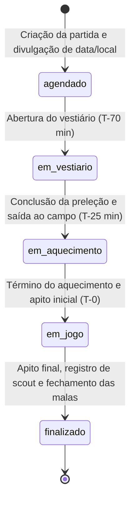
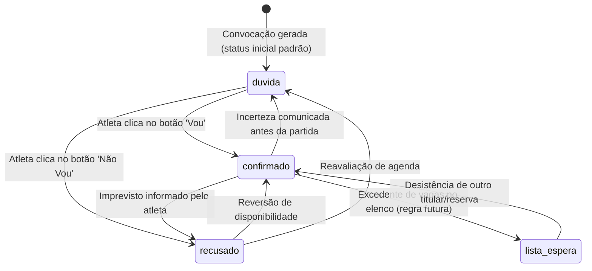
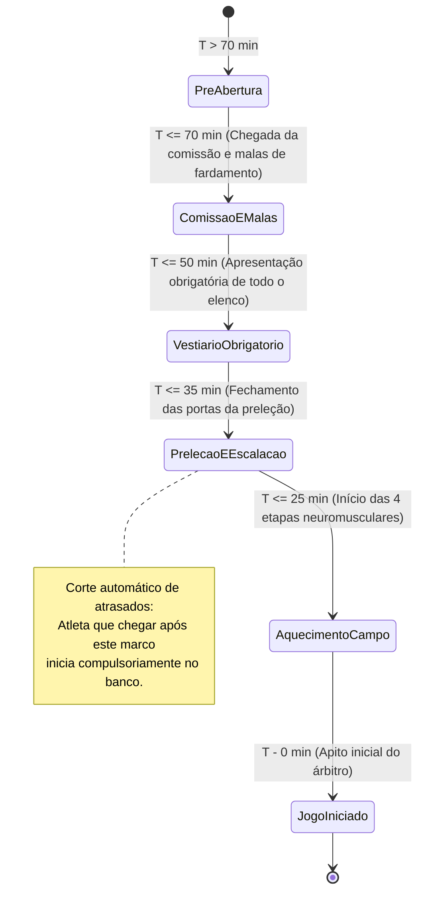
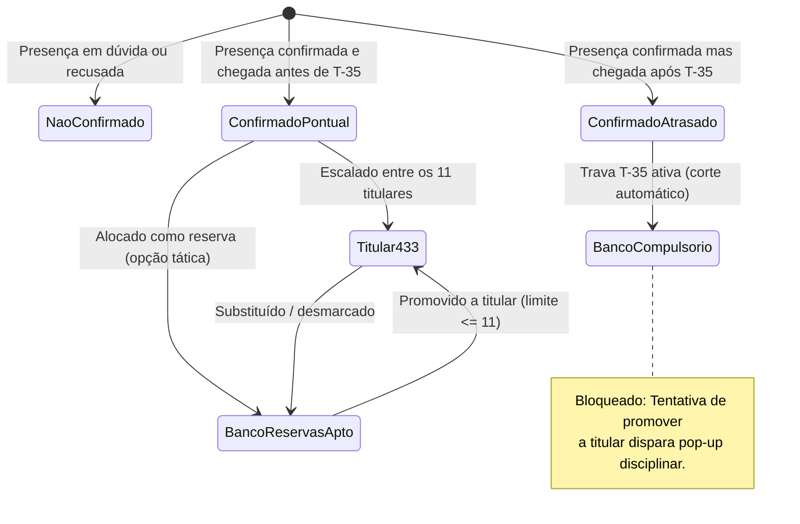
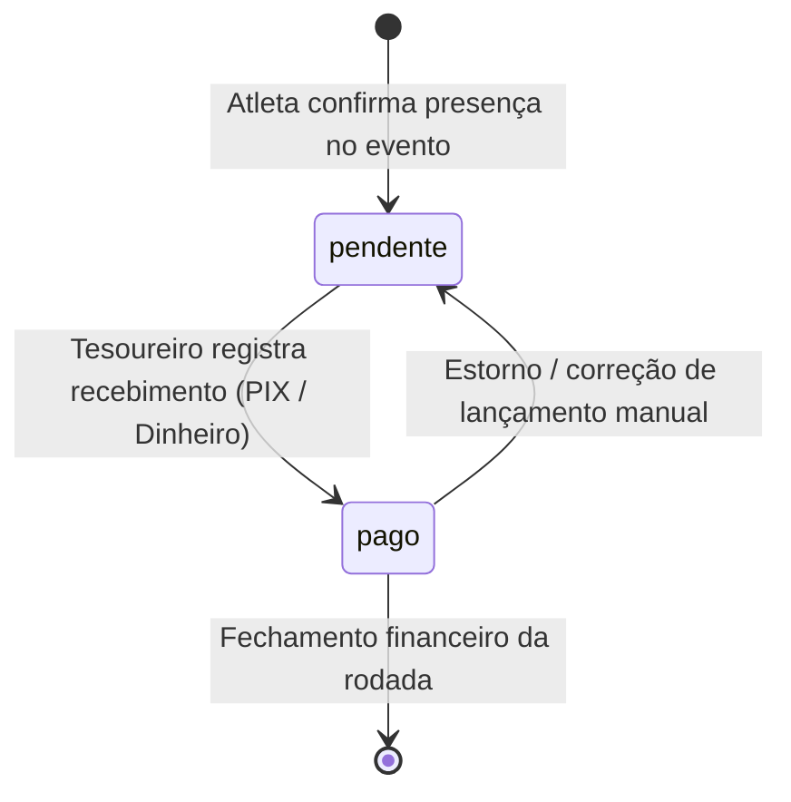
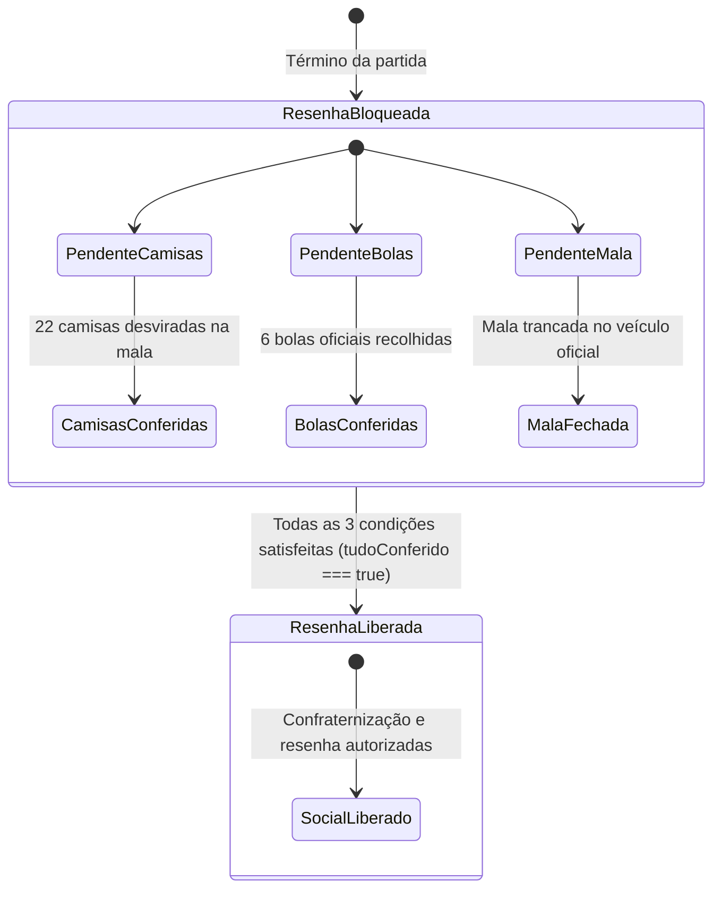

# Máquinas de Estado — Na Prancheta

> Gerado pelo **Reversa Detetive** em 18/09/2026  
> Nível de Documentação: **Detalhado**  
> Escopo: Ciclos de vida, transições de status e diagramas de estado em Mermaid

---

## 1. Máquina de Estados: Ciclo de Vida do Evento / Partida

Controla o progresso cronológico de um confronto esportivo desde a criação até o encerramento da rodada.

---

## 2. Máquina de Estados: Confirmação de Presença (`EventoPresenca`)

Controla a resposta individual do atleta no quadro de presenças da partida.

---

## 3. Máquina de Estados: Protocolo Oficial de Vestiário

Regula a linha do tempo regressiva de 70 minutos pré-jogo e as obrigações disciplinares.

---

## 4. Máquina de Estados: Escalação Tática e Condição do Atleta

Determina o enquadramento de um atleta na prancheta técnica durante o dia do jogo.

---

## 5. Máquina de Estados: Cobrança da Vaquinha do Jogo (`EventoColetaDia`)

Controla o fluxo financeiro da taxa individual da partida.

---

## 6. Máquina de Estados: Trava da Resenha Social (Almoxarifado)

Regula a liberação da resenha e consumo de bebidas pelo elenco no pós-jogo.

